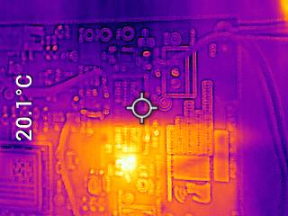

# a14g-final-submission

    * Team Number: T08
    * Team Name: Magic Curtain Opener
    * Team Members: Weiheng Zhuang & Yining Xia
    * Github Repository URL: https://github.com/ese5160/a14g-final-submission-t08-magic-curtain
    * Description of test hardware: Win11 Desktop, SAMW25 Custom board

## 1. Video Presentation

Click on photo below to view the vedio

## 2. Project Summary

- **Device Description**

    - What problem is your device solving? How do you use the Internet so augment your device functionality?

        Our device, a remote-controlled curtain opener, simplifies the management of home lighting and privacy. 
        
        It utilizes internet connectivity to facilitate remote operation, allowing users to adjust their curtains from anywhere with an internet connection. Additionally, the device leverages the internet to access and process data from various sensors, enhancing its functionality and user experience.

- **Inspiration**

    - What inspired you to do the project?

        The inspiration for this project stemmed from the personal challenge of waking up in the morning without the jarring sound of an alarm. By integrating a 'smart mode' in the curtain opener, it can autonomously open the curtains when the sunlight reaches a set threshold, allowing for a natural and gentle morning wake-up with sunlight, aligning with the body's natural response to light.

- **Device Functionality**

    - Explain how the Internet-connected device is designed 

    - Include sensors, actuators, and other critical components.

        The core of our Internet-connected device revolves around the SAMW25 chip, which enables seamless wireless internet connectivity. This chip acts as the brain of the device, facilitating communication between the various components and the user interface.
        The primary function of our device is curtain manipulation, which is achieved using a continuous rotation servo motor mounted on the curtain rod. We selected the PWM-controlled TR-90 model for its precision and reliability in controlling the curtain movement. The servo motor is directly connected to the SAMW25 chip, allowing for accurate control and feedback.
        Our device offers three distinct operational modes to cater to different user preferences and needs:

        1. Manual Mode: In this mode, users can instantly adjust the curtains using a cloud-based interface. The interface communicates with the SAMW25 chip, which then sends the appropriate signals to the servo motor to open or close the curtains to the desired position.
        
        2. Timer Mode: This mode allows users to preset specific times for the curtains to open and close automatically. The SAMW25 chip maintains an internal clock and triggers the servo motor at the programmed times, ensuring consistent and hassle-free curtain operation.

        3. Smart Mode: The smart mode leverages a array of sensors to intelligently adjust the curtains based on environmental factors. A light intensity sensor detects the amount of sunlight entering the room, and the SAMW25 chip processes this data to determine the optimal curtain position for energy efficiency and user comfort. 

        Additionally, we incorporated a humidity and temperature sensor to monitor the room's conditions and make further adjustments to the curtains as needed. An air quality sensor rounds out the environmental monitoring capabilities, ensuring that the device can respond to changes in air quality and maintain a healthy indoor environment.

        To provide a clear understanding of the device's components and their interconnections, we created a block diagram earlier in the semester. This diagram visually represents the flow of data and control signals between the SAMW25 chip, the servo motor, the various sensors, and the user interface. It serves as a valuable reference for understanding the device's architecture and functionality.

        Block diagram of the device is shown below:

        

- **Challenges**

    - Where did you face difficulties? This could be in firmware, hardware, software, integration, etc.
    - How did you overcome these challenges?

        During the development process of our Internet-connected device, we encountered several challenges related to firmware, hardware, software, and integration. These difficulties required careful analysis and creative problem-solving to overcome.

        One of the first challenges we faced was a design error in our custom PCB. When designing the circuits, we inadvertently connected the SDA (Serial Data) line to the SCL (Serial Clock) line for the I2C communication protocol. This mistake could have potentially rendered the I2C communication non-functional. Fortunately, we had incorporated jumpers and test points in our PCB design, which allowed us to reconnect the misconnected wires. By carefully rewiring the SDA and SCL lines using the jumpers and test points, we were able to resolve this issue and ensure proper I2C communication between the components.

        Another significant challenge we encountered was related to implementing the timer mode functionality in our device. We wanted to enable users to set specific times for the curtains to open and close automatically. To achieve this, we needed to create a dedicated task in FreeRTOS to keep track of real-time timing. However, during the implementation process, we faced compilation issues, and the task creation process kept getting stuck.
        To diagnose the problem, we utilized the watermark function in FreeRTOS, which helps in monitoring memory usage and identifying potential memory-related issues. Upon investigation, we discovered that we had allocated too much memory to the timer task, exceeding the available memory limits. This excessive memory allocation was causing the task creation to fail.
        To overcome this challenge, we carefully analyzed the memory requirements of the timer task and optimized its stack size. By minimizing the memory allocated to the timer task, we were able to resolve the compilation issues and successfully create the task. This optimization process involved finding the right balance between providing sufficient memory for the task to operate correctly and not exceeding the available memory constraints.
        By employing debugging techniques, such as using the watermark function, and carefully reviewing and optimizing our code, we were able to overcome the memory allocation issue and ensure the proper functioning of the timer mode in our device.

- **Prototype Learnings**

    - What lessons did our learn by building and testing this prototype?

    - If we had to build this device again, what would us do differently?

        Through the process of building and testing our prototype, we gained valuable insights and learned important lessons that will shape our future development efforts.
        One crucial lesson we learned is the significance of thoroughly testing the power module at the initial stages of development. In our case, we encountered a challenge where we had mistakenly connected the SDA and SCL lines. However, if we had made a similar mistake with the 3V3 and 5V power lines, the consequences could have been catastrophic. Connecting the wrong voltage to sensitive components could have resulted in permanent damage to the hardware, rendering the device non-functional. This experience emphasizes the need for meticulous attention to detail and rigorous testing of the power module to ensure the safety and reliability of the device.
        Another key learning from our prototype development is the importance of incorporating jumpers and test points in the PCB design. These features proved to be invaluable when we encountered the issue with the swapped SDA and SCL lines. By having jumpers and test points readily available, we were able to quickly diagnose the problem and rewire the connections correctly. This flexibility in the design allowed us to recover from the error and proceed with the development process. Going forward, we recognize the value of including jumpers and test points as a standard practice in our PCB designs to facilitate debugging and troubleshooting.

        If we had the opportunity to build this device again, we would prioritize drawing the circuits with even greater care and precision. While we were able to resolve the SDA and SCL line issue, it highlighted the need for meticulous circuit design to prevent similar mistakes in the future. We would allocate more time and resources to double-check and verify the connections, ensuring that each component is correctly wired and that the overall circuit design is robust and error-free. 

- **Next Steps**

    - What steps are needed to finish or improve this project?

        1. Inverting Button for Smart Mode: In the current implementation of the smart mode, the curtains open in the morning and close in the evening based on the light intensity sensor. However, we recognize that some users may prefer to sleep longer and keep the curtains closed even when the sunshine is strong. To accommodate this preference, we could add an inverting button feature. This button would allow users to override the default behavior and keep the curtains closed during periods of intense sunlight, providing flexibility and customization options.
        2. Screenless Version: While the current prototype includes a screen for user interaction and feedback, we acknowledge that the screen's visibility may be limited when the device is mounted on the curtain rod. To address this, we could develop a screenless version of our device. By eliminating the screen, we can create a more streamlined and discreet design that seamlessly integrates with the curtain rod. Users would still have full control over the device through the cloud-based interface or mobile app, ensuring a user-friendly experience without compromising functionality.

- Takeaways from ESE5160

    - What did us learn in ESE5160 through the lectures, assignments, and this course-long prototyping project?

        One of the most significant takeaways from this course was learning how to design and create PCBs using Altium Designer. Altium is a powerful and industry-standard tool for PCB design, and gaining proficiency in it is a crucial skill for any electronics engineer. Throughout the course, we had the opportunity to dive deep into Altium and explore its various features and capabilities. We learned how to create schematic diagrams, design PCB layouts, and generate manufacturing files. This hands-on experience with Altium has equipped us with the ability to transform our ideas and circuits into physical boards, which is a fundamental aspect of electronic product development.
        
        Another valuable aspect of ESE5160 was the emphasis on programming and debugging with FreeRTOS. FreeRTOS is a popular real-time operating system widely used in embedded systems. Through the course, we gained a solid understanding of the principles and practices of real-time programming using FreeRTOS. We learned how to create and manage tasks, handle inter-task communication, and utilize synchronization primitives such as semaphores and mutexes. The assignments and projects provided us with practical opportunities to apply these concepts and develop our skills in writing efficient and reliable embedded software.

- **Project Links**

    - Node-RED instance for our review: [Node-RED Link](http://74.249.109.202:1880/ui)

    - Codes: [A12 Link](https://github.com/ese5160/a12g-firmware-drivers-t08-magic-curtain)

    - Final PCBA on Altium 365: [PCBA Link](https://upenn-eselabs.365.altium.com/designs/754D0AFD-A89A-461E-8F2C-72B919B5E2A2#design)

## 3. Hardware & Software Requirements

### 3.1 Software Requirements:

**HRS 01 (System Composition)**: The system shall be based on a customized PCB board with SAM W25 microcontroller, photoresistor, tempertature and humidity, servo motor, LCD screen, air quality IC, IR receiver, ensuring component compatibility.

- Check, We used our custome PCB for Demo and video

**HRS 02 (Sensor and Motor Functionality)**: All sensors and motors shall perform efficiently and reliably under defined conditions.

- Check, we used a 160x128 LCD screen to present sensors data and also add a CLI command to show data and drive motor

**HRS 03 (Curtain Opener Housing)**: The housing shall robustly enclose all electronics, protecting them from environmental factors.

- Check, we used a 3D printing case to achieve it

**HRS 04 (Mounting and Positioning)**: The curtain opener should mount securely on a curtain rod, with the servo motor's wheel in contact with the rod for precise movement control.

- Check, we have it in the demo as well as video

### 3.2 Software Requirements:

**SRS 01 (Curtain and Environment Data Retrieval)**: The system shall enable users to access real-time curtain status and environmental data (temperature, humidity, air quality) via a smartphone app.

- Check, we create a timer tasks in FreeRTOS that controls setting and showing time, in video demo

**SRS 02 (Curtain Time Adjustment)**: The system shall allow users to modify curtain operating times through the app.

- Check, the same as **SRS 01**

**SRS 03 (Manual Curtain Opening)**: The app shall provide a feature to open curtains using an “Open Curtain” button.

- Check, we implement this in sensor task, also showing in demo video

**SRS 04 (Automated Curtain Opening by Time)**: Users shall be able to set specific times for automatic curtain opening in the app.

- Check, showing in demo video

**SRS 05 (Automated Curtain Opening by Sunlight)**: With “Smart Decision” mode, the system shall open curtains automatically in intense sunlight.

- Check, showing in demo video

**SRS 06 (Manual Curtain Closing)**: The app shall include a “Close Curtain” button for manual curtain closure.

- Check, showing in demo video

**SRS 07 (Automated Curtain Closing by Time)**: Users shall be able to program specific times for automatic curtain closure.

- Check, showing in demo video

**SRS 08 (Automated Curtain Closing by Low Sunlight)**: In “Smart Decision” mode, the system shall close curtains in low sunlight conditions.

- Check, we used a photoresistor to handle this, showing in demo video

**SRS 09 (Remote Control)**: Users shall operate the openess of curtain via remote control.

- Check, showing in demo video

**SRS 10 (Curtain Opening Constraint)**: The system shall prevent curtain opening if already open.

- Check, we set a bool parameter to determine if the curtain is already open.

**SRS 11 (Curtain Closing Constraint)**: The system shall prevent curtain closing if already closed.

- Check, we set a bool parameter to determine if the curtain is already close.

**It seems like we have accomplied all our goals this semester.**

## 4. Project Photos & Screenshots

- Final Project Imaging
    
    

- The standalone PCBA, top
    
    

- The standalone PCBA, bottom
  
    

- Thermal camera images while the board is running under load
    
    

- The Altium Board design in 2D view (screenshot)
    
    

- The Altium Board design in 3D view (screenshot)
    
    

- Node-RED dashboard (screenshot)
- 
    

- Node-RED backend (screenshot)
  
    

- Block diagram of your system
    
    